# Automated test project with web, api and mobile tests for [Airbnb](https://www.airbnb.ru/) service


| Airbnb, Inc. is an American company that operates an online marketplace for lodging, primarily homestays for vacation rentals, and tourism activities

# <a name="Technology">Tools and technologies</a>
<p  align="center">


## :page_facing_up: Test cases
- #### Web
<p align="center">
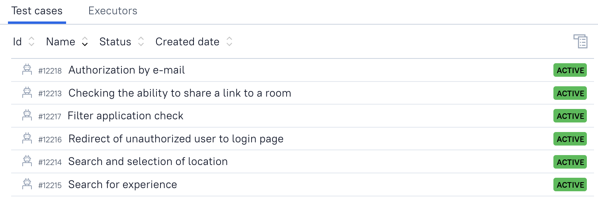
</p>

- #### API
<p align="center">
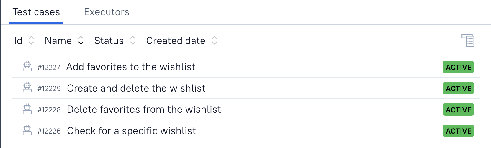
</p>

- #### Mobile
<p align="center">
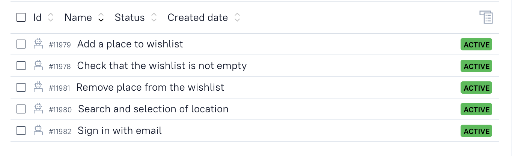
</p>

## <a name="RunInJenkins">  Run in [Jenkins](https://jenkins.autotests.cloud/job/airbnb_test_project/)
<p align="center">
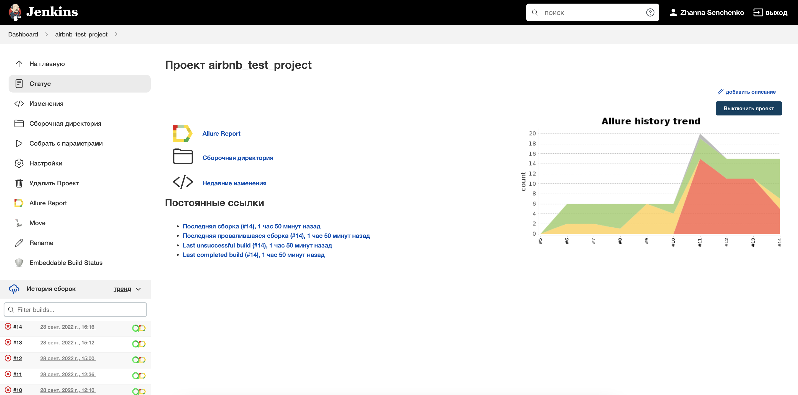
</p>

### <a name="Running tests with parameters"></a> Running tests with parameters
<p align="center">
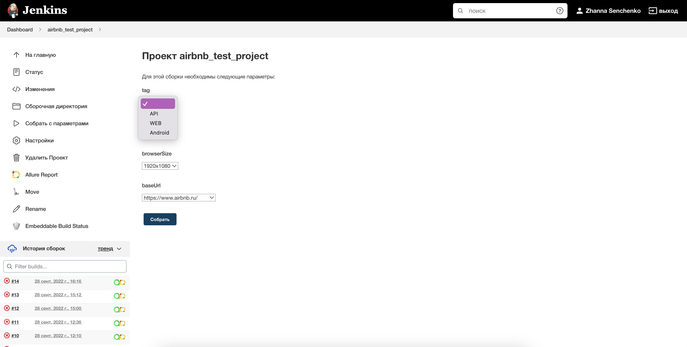
</p>

#### Gradle command
To run locally and in Jenkins the following command is used:
```bash
gradle clean test -Dtag=<tag>
```
`tag` - type of tests for execution:
>- *API*
>- *WEB*
>- *Android*

Additional parameters:
> `-Dbrowser` - Browser type: chrome, yandex, safari\
> `-DbrowserSize` - Browser size:
1920x1080
1366x768
1024x768\
> `-DbaseUrl` url to run tests
> `-DwebHost` host to run web tests
> `-DdeviceHost` device to run mobile tests
```bash
clean
test
-Dtag=${tag}
-Dbrowser=${browser}
-DbrowserSize=${browserSize}
-DbaseUrl=${baseUrl}
-DwebHost=${webHost}
-DdeviceHost=${deviceHost}
```

## <a name="Allure Report"></a> Allure [Report](https://jenkins.autotests.cloud/job/airbnb_test_project/14/allure/)
### Overview
<p align="center">
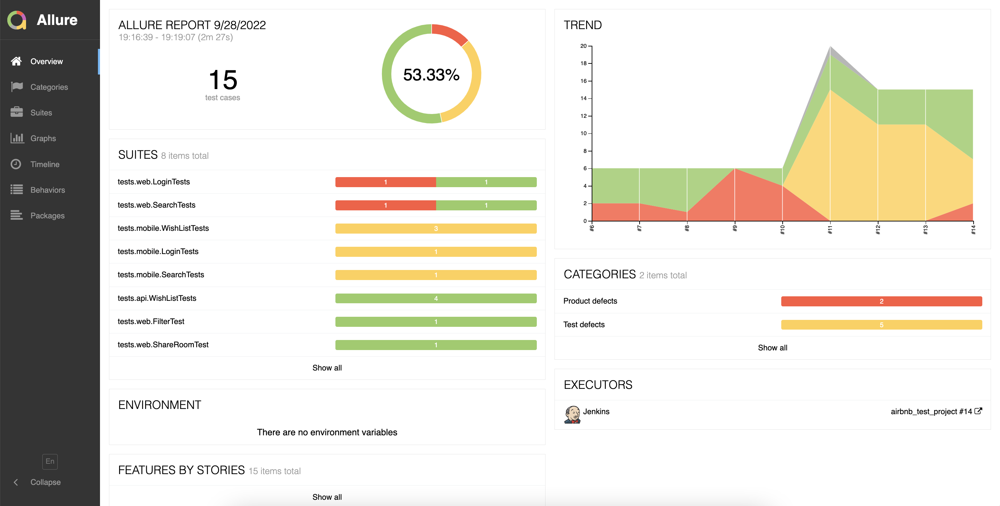
</p>

### Test suites
The report contains a list of tests, with detailed steps, screenshots and videos of the results
<p align="center">
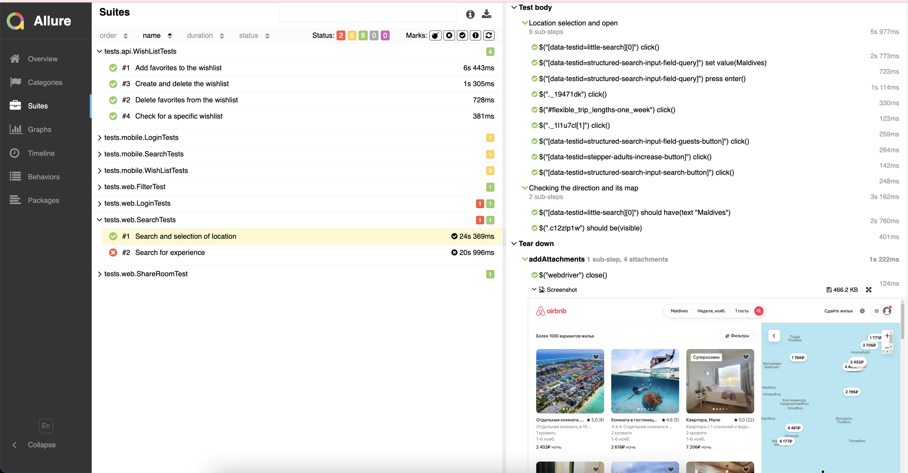
</p>

## <a name="Allure TestOps"></a> [Allure TestOps](https://allure.autotests.cloud/project/1501/) integration 

### Dashboards
<p align="center">

</p>

### Test cases
<p align="center">
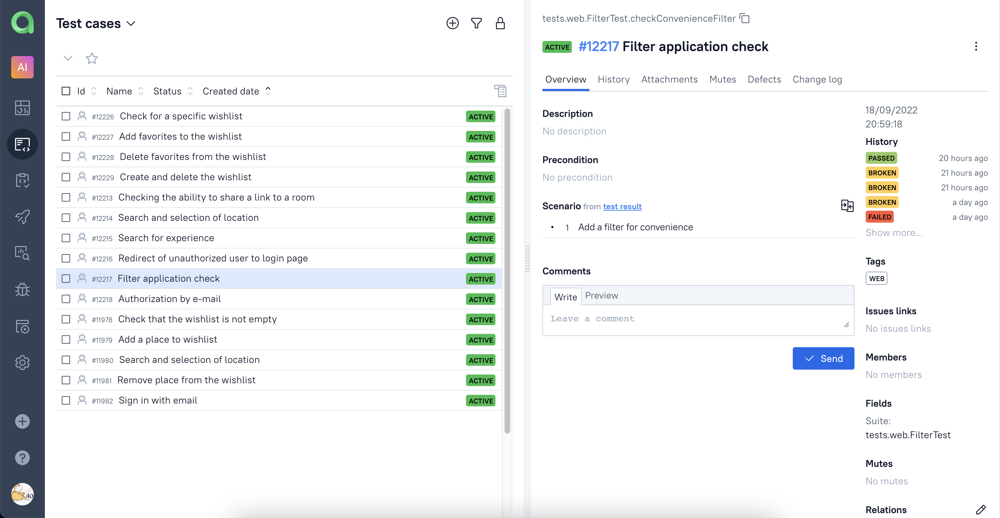
</p>

### Launches
<p align="center">
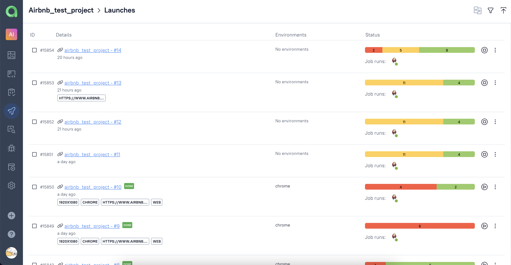
</p>

##  Telegram notifications
<p align="center">
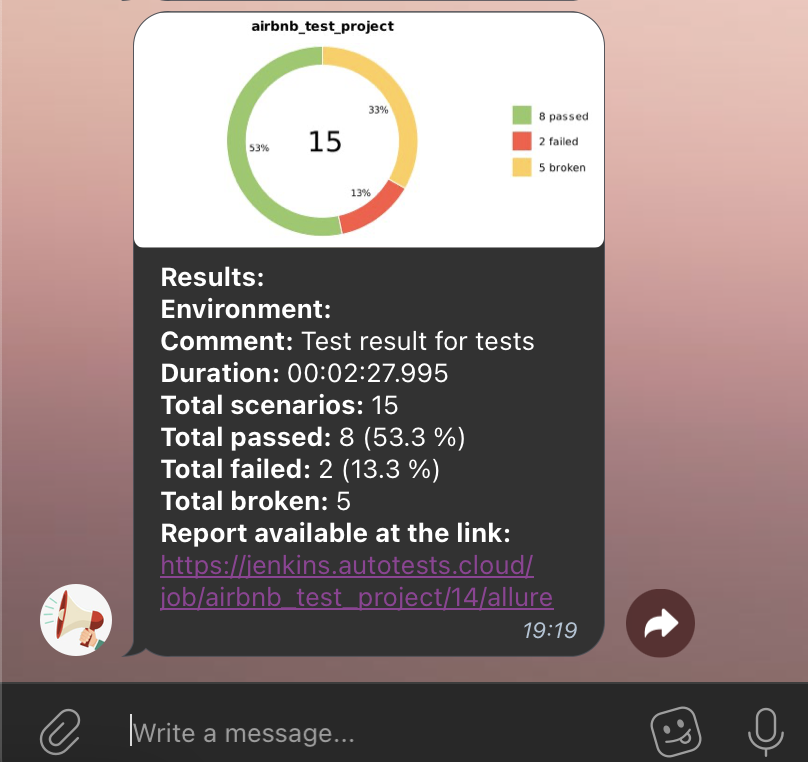
</p>

## <a name="Video"></a> :vhs: Video examples
### Web test
<p align="left">
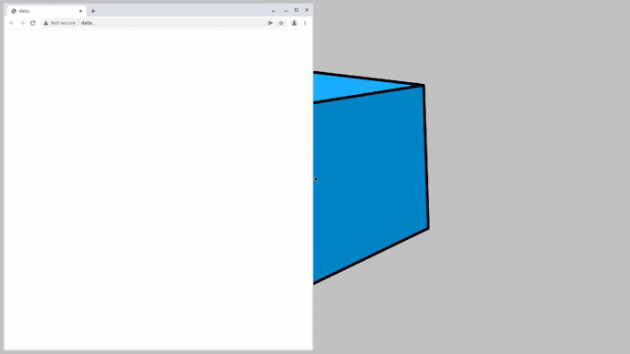
</p>

### Mobile tests
<p align="left">

</p>